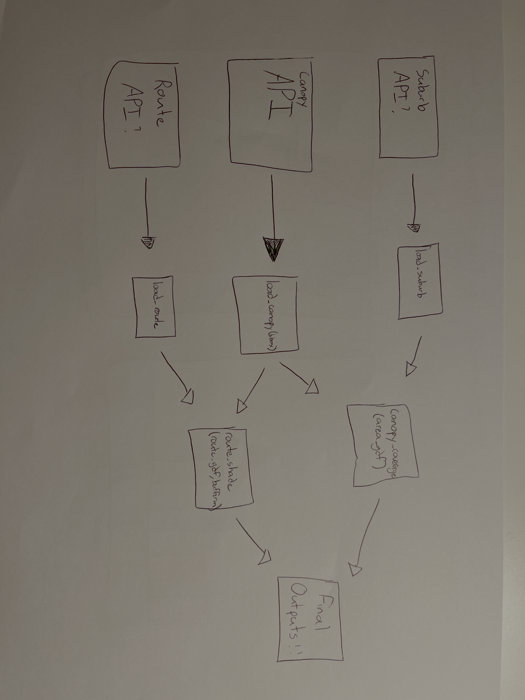
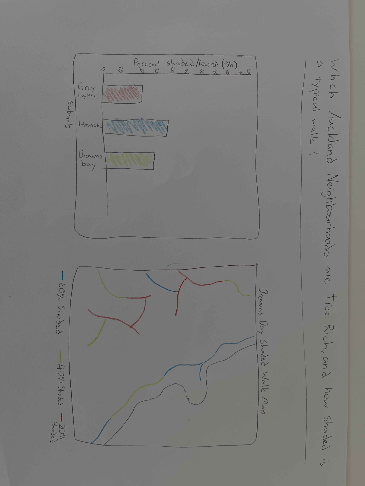

## Problem statement

A walkable urban environment requires more than built infrastructure. In many Auckland locations, the quality of walkways is inhibited by the lack of natural tree cover that provides critical protection from wind, sun and rain. This project fetches tree cover for selected Auckland suburbs and automates the calculation process by providing percentage values of tree cover. This tree cover value will be calculated through LiDAR data, specifically the difference between Digital Elevation Models (DEMs) and Digital Surface Models (DSM), assuming that all pixels with a value of less than or equal to 10 metres represent trees or similar ecological coverage. Finally, this project will return a percentage of tree cover on a given route and a set buffer area, acting as a representation for pedestrian shade. This will be matched with a figure of shaded percentage of three selected suburbs. 

Relevant research has been performed by Auckland Council in 2021, by Golubiewski et al. This analysis acts as the foundation for our work, as it likewise uses LiDAR data to understand the Auckland forestry canopy. There are three key differences between the work of Golubiewski et al and ours. The first of which is the time scale of which the analysis takes place. This Auckland Council report uses LiDAR data from 2018, which is already 6 years out from the latest publicly accessible LiDAR information. This time scale is critical, as Auckland Council has a goal to increase urban tree canopy to 30% by 2050 (Auckland’s Urban Ngahere (Forest) Strategy, 2019). It is important to see if we are on track to improve from the 18% canopy cover found in 2019. 

Secondly, our analysis is unique for its direct mapping to urban footpaths. We will be looking specifically at footpaths for two reasons: firstly, it provides critical constraints to our project, as we lack the time or resources to apply our analysis to the entirety of Auckland. Secondly, specifically looking at footpaths provides a unique interpretation of the LiDAR data that has the potential to be useful for people in their own environments. Small-scale information on the areas most critically in need of coverage is the focus of this package, 

Finally, our project will be deployed directly into a PiPy package. This further enhances its use for everyday people, as opposed to a council report. Our package will allow for a level of individualisation, ensuring users can explore their own areas of interest. One specific example of this is a user inputting a location on a walkway that is local to them, to provide them with a likely estimate of environmental exposure if they were to walk along that pathway.

## Pipeline diagram

The package takes a tree cover layer as a geodataframe and turns it into a numeric representation of tree cover along a route.
@fig-pipeline shows the three functions and how data flows between them.

{#fig-pipeline width=80%}

## Expected output

@fig-output is the sketch of what the demo notebook will produce on the last cell.

{#fig-output width=80%}

## Key design choices

- **CRS**: we use EPSG:2193 (NZTM) because it is the most accurate for geospatial data in New Zealand.
- **Data pattern**: data is fetched through an API due to the significant file sizes of geopackages.

## Roles and next function

Hayden will own def load_canopy() for the first draft. Joel will focus on def canopy_coverage(). Both partners review all code.

Next priority to implement after today's lab: linking API calls to get data in a computationally reasonable way. 

## References

Auckland’s Urban Ngahere (Forest) Strategy. (2019). In Auckland Council. https://www.aucklandcouncil.govt.nz/content/dam/ac/docs/plans/environmental-strategy/urban-ngahere-forest-strategy.pdf

Golubiewski, N., Lawrence, G., Zhao, J., & Bishop, C. (2020). Auckland’s Urban Forest Canopy Cover: State and Change: Revised April 2021. In Auckland Council (2020/009-2). https://knowledgeauckland.org.nz/media/2066/tr2020-009-2-aucklands-urban-forest-canopy-cover-2013-2016-2018-revised-april-2021.pdf

